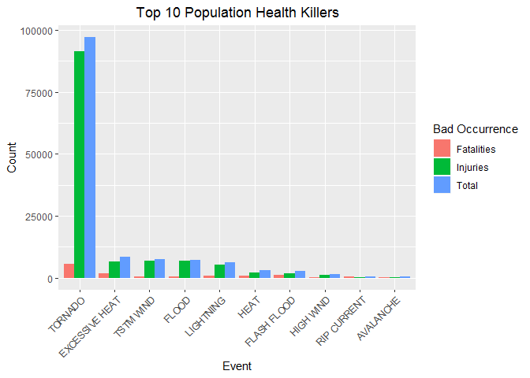

Exploring the Storm database to find out the top population health and economic killers
=======================================================================================

Synopsis:
=========

In this project, we are exploring and analysing the U.S. National
Oceanic and Atmospheric Administration’s (NOAA) storm database. This
database tracks characteristics and impacts of major natural
catastrophic events in the United States. We are going to explore the
impact of chatastrophic events on the population health and economy of
the country.

Loading the required libraries:

``` r
library(dplyr)
library(ggplot2)
library(tidyr)
```

Data Processing
---------------

The file is downloaded and read:

``` r
temp<-"StormData.csv.bz2"
download.file("https://d396qusza40orc.cloudfront.net/repdata%2Fdata%2FStormData.csv.bz2",temp,mode="wb")
main_df<-read.csv("StormData.csv.bz2")
```

### The loaded dataset is filtered to get rid of missing value rows

``` r
health<-subset(main_df,!is.na(main_df$EVTYPE) && !is.na(main_df$FATALITIES) && !is.na(main_df$INJURIES))
economy<-subset(main_df,!is.na(main_df$PROPDMG) && !is.na(main_df$CROPDMG))
```

### Analysing the data for finding the top population health killers

We are using dplyr function to get the required dataset. Dataset is
grouped on the basis of events and then summarized. Dataset rows are
arranged in decreasing order of number of fatalities and top 10 events
are considered.

``` r
df<-tbl_df(health)
df<-group_by(df,EVTYPE)
df_s<-summarize(df,Fatalities=sum(FATALITIES),Injuries=sum(INJURIES),Total=sum(FATALITIES)+sum(INJURIES))
df_s<-arrange(df_s,desc(Fatalities))
df_s<-as.data.frame(df_s)
df_s<-df_s[1:10,]
df_s<-gather(df_s,"badthing","value",2:4)
```

### Analysing the data for finding the top economic killers

We are using dplyr function to get the required dataset. Dataset is
grouped on the basis of events and then summarized. There are values of
damages in the dataset and their exponents in the other columns. Since
the exponents are present in random format. We clean them and put
respective numbers in place of them. Total values are generated by
multiplying the values to their exponents. Dataset rows are arranged in
decreasing order of number of total damages and top 10 events are
considered.

``` r
economy<-tbl_df(economy)
economy<-select(economy,EVTYPE,PROPDMG,PROPDMGEXP,CROPDMG,CROPDMGEXP)
levels(economy$PROPDMGEXP)[levels(economy$PROPDMGEXP)==""]<-"n"
levels(economy$CROPDMGEXP)[levels(economy$CROPDMGEXP)==""]<-"n"
prop<-c("n"=1,"-"=1,"?"=1,"+"=1,"0"=1,"1"=10,"2"=10^2,"3"=10^3,"4"=10^4,"5"=10^5,"6"=10^6,"7"=10^7,"8"=10^8,"B"=10^9,"h"=10^2,"H"=10^2,"K"=10^3,"m"=10^6,"M"=10^6)
crop<-c("n"=1,"?"=1,"0"=1,"2"=10^2,"B"=10^9,"k"=10^3,"K"=10^3,"m"=10^6,"M"=10^6)
economy$PROPDMGEXP<-prop[as.character(economy$PROPDMGEXP)]
economy$CROPDMGEXP<-crop[as.character(economy$CROPDMGEXP)]
economy<-mutate(economy,prop_total=PROPDMG*PROPDMGEXP,crop_total=CROPDMG*CROPDMGEXP)
economy<-select(economy,EVTYPE,prop_total,crop_total)
economy<-group_by(economy,EVTYPE)
economy<-summarize(economy,prop=sum(prop_total),crop=sum(crop_total),total=prop+crop)
economy<-arrange(economy,desc(total))
economy<-economy[1:10,]
economy<-gather(economy,"estimate","value",2:4)
```

Results:
--------

Results are displayed by plotting bargraphs:

``` r
g<-ggplot(df_s,aes(x=reorder(EVTYPE,desc(value)),y=value,fill=badthing))
g+geom_bar(stat="identity",position="dodge")+xlab("Event")+ylab("Count")+theme(axis.text.x=element_text(angle=45,hjust=1))+ggtitle("Top 10 Population Health Killers")+theme(plot.title=element_text(hjust=0.5))+scale_fill_discrete(name="Bad Occurrence")
```



``` r
j<-ggplot(economy,aes(x=reorder(EVTYPE,desc(value)),y=value,fill=estimate))
j+geom_bar(stat="identity",position="dodge")+xlab("Event")+ylab("Count")+theme(axis.text.x=element_text(angle=45,hjust=1))+ggtitle("Top 10 Economy Killers")+theme(plot.title=element_text(hjust=0.5))+scale_fill_discrete(name="Damages",labels=c("Crop","Property","Total"))
```


